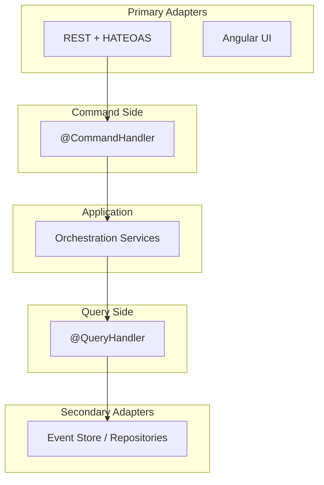

# Buoyancy Operated Aquatic Transport Society (BOATS)

_An enterprise-grade Spring Boot & Angular application illustrating Hexagonal Architecture with CQRS, Event Sourcing, and HATEOAS._

---

## Table of Contents

1. [Overview](#overview)
2. [Features](#features)
3. [Architecture](#architecture)
    - [Hexagonal Flow](#hexagonal-flow)
    - [Global Schema](#global-schema)
    - [CQRS + HATEOAS Schema](#cqrs--hateoas-schema)
4. [Getting Started](#getting-started)
5. [Testing](#testing)
6. [Configuration](#configuration)
7. [Documentation](#documentation)
8. [Contributing](#contributing)
9. [License](#license)

---

## Overview

**BOATS** is an over-engineered yacht-club association society management system (aka CRUD) built to enterprise standards:

- **Hexagonal (Ports & Adapters)** for clear separation of concerns
- **CQRS & Event Sourcing** via Axon Framework
- **HATEOAS-driven** REST endpoints for self-describing APIs
- **Spring Boot** backend, **Angular** frontend
- End-to-end **Cucumber** scenarios and **ApprovalTests**

---

## Technical Features

- **CQRS**: Separate command (write) model from query (read) model
- **Event Sourcing**: Immutable event streams capture every state change
- **HATEOAS**: Hypermedia links guide clients through resources

## Use Cases

- **UC1** – Login screen, authenticate user, redirect to overview
- **UC2** – List all boat resources
- **UC3** – Add, update, or delete a boat
- **UC4** – View detailed information for a selected boat

---

## Functional Requirements

- **REQ 1** – CRUD endpoint for boats (must include `name`, `description`, plus validation)
- **REQ 2** – Authentication/authorization: only authenticated users can access resources

---

## Architecture

### Hexagonal Flow

```mermaid
flowchart LR
   subgraph PrimaryAdapters["Primary Adapters"]
      REST["REST / UI / CLI"]
   end
   subgraph Application["Application"]
      AppSvc["Application Services"]
   end
   subgraph DomainLayer["Domain"]
      DM["Domain Model"]
   end
   subgraph SecondaryAdapters["Secondary Adapters"]
      Sec["DB / Cache / External WS"]
   end

   REST --> AppSvc
   AppSvc --> DM
   DM --> Sec

````

### Global Schema

```mermaid
flowchart LR
    subgraph Primary Adapters
      A1["Web Service"]
      A2["UI"]
      A3["Console"]
      A4["Listeners"]
    end

    subgraph Hexagon [Domain & Application]
      subgraph Ports
        P1["Command Port"]
        P2["Query Port"]
      end
      DM["Domain Model"]
      ASvc["Application Services"]
    end

    subgraph Secondary Adapters
      S1["Persistence"]
      S2["Cache"]
      S3["Messaging"]
      S4["File System"]
      S5["External WS"]
    end

    A1 & A2 & A3 & A4 --> ASvc
    ASvc --> DM
    DM --> P1 & P2
    P1 & P2 --> S1 & S2 & S3 & S4 & S5
```

### CQRS + HATEOAS Schema


---

## Getting Started

### Prerequisites

* **Java 24+**, **Maven 3.9+**
* **Node.js 22+**, **NPM 10.9+**
* **Docker** for PostgreSQL & RabbitMQ

if you use SDKMAN and NVM, you can run:

```bash
sdk env
nvm use
```

### Backend

```bash
./mvnw
```

### Frontend

```bash
npm install
npm start
```

*App runs at `http://localhost:4200` (proxies to API).*

---

## Testing

* **Unit & Integration**: JUnit 5, Mockito, ApprovalTests
* **Behavioral**: Cucumber features under `src/test/features`
* **Event Stream**: Axon test fixtures

Run all tests:
```bash
./mvnw verify
npm test
```


if you are using colima with macOS, don't forget or TestingContainers won't work :
```bash
export DOCKER_HOST="unix://${HOME}/.colima/default/docker.sock"
export TESTCONTAINERS_DOCKER_SOCKET_OVERRIDE=/var/run/docker.sock
```

---

## Configuration

Key Spring settings in `server/src/main/resources/application.yml`:

```yaml
axon:
  eventhandling:
    processors:
      queryProcessor:
        mode: tracking

application:
  cors:
    allowed-origins: http://localhost:4200
    allowed-methods: "*"
```

Angular HATEOAS client is configured in `client/src/environments/`.
